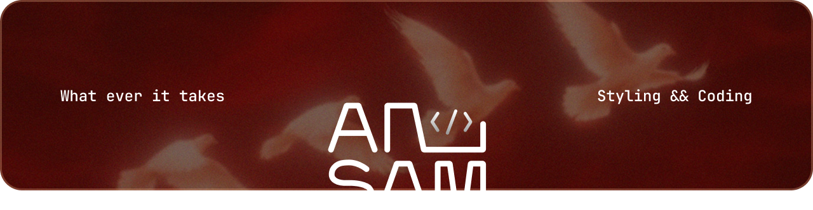

  

<h1 align="center">Ansam Yaseen Ahmed</h1>

<strong>Full Stack Developer • UI/UX Enthusiast • Freelancer</strong>

  

  
  
  
  

---

## 💫 Professional Summary

Results-driven **Full Stack Developer** with strong experience engineering scalable, high-performance web applications using **React.js**, **Vue.js**, and modern **JavaScript (ES6+)** alongside backend frameworks like **PHP/Laravel**. 

* 🎨 **Figma to Code Specialist**: Adept at translating complex Figma designs into responsive, pixel-perfect, and accessible user interfaces.
* ⚙️ **Robust Architectures**: Experienced in architecting robust backend infrastructures, database designs, and integrating secure RESTful & GraphQL APIs.
* 📈 **High Performance**: Dedicated to performance optimization, state management, and delivering cross-browser compatible, responsive solutions.
* 💼 **Proven Delivery**: Maintained a **100% Job Success Score** on Upwork, consistently delivering high-quality, scalable products for international clients.

---

## 🛠️ Tech Stack & Skills

  

<b>Detailed Tech Stack Breakdowns</b>

 

| Category | Technologies & Tools |
| :--- | :--- |
| **Frontend Development** | React.js (Hooks, Context, Custom Hooks), Vue.js, TypeScript, JavaScript (ES6+), HTML5, CSS3 |
| **Styling & UI Frameworks** | Tailwind CSS, Bootstrap, CSS Modules, Sass/SCSS |
| **UI/UX Design & Animation** | Figma, Adobe Photoshop, Wireframing, Prototyping, GSAP, Framer Motion, CSS Animations |
| **State & Data Management** | Context API, Redux (Basic), React Query (Data Fetching) |
| **Backend & APIs** | PHP/Laravel, MySQL, SQLite, RESTful APIs, GraphQL (Apollo Client), Axios, Fetch API |
| **Workflow & Development** | Git/GitHub, VS Code, npm/yarn, Webpack, Vite, Chrome DevTools |
| **Practices** | Component-Driven Development, Responsive Web Design, Cross-browser Testing, Agile/Scrum, Code Reviews |

---

## 💼 Professional Experience

### 🚀 **Freelance Full Stack / Frontend Developer** | Upwork
**Remote • Jan 2024 – Present**  
*Delivering high-quality, scalable products for international clients with a **100% Job Success Score**.*

* **E-Commerce Platform for Saudi Luxury Pastry Shop**
  * Built a full-featured e-commerce app featuring custom UI/UX implementation, geolocation-based delivery services, and dynamic RTL/LTR language support.
  * **Tech Stack:** Vue.js, JavaScript, Bootstrap.
  * **Client Feedback:** ⭐ 5.0 / 5.0
* **Real-Time Dashboard with Linear API Integration**
  * Engineered a real-time analytics dashboard powered by GraphQL API. Secured optimized performance (Lighthouse score 95+) and structured scalable, reusable frontend components with strict state management.
  * **Tech Stack:** React, TypeScript, GraphQL.
  * **Client Feedback:** ⭐ 5.0 / 5.0
* **Laravel Backend Development & EdfaPay Integration**
  * Formulated RESTful APIs equipped with robust authentication systems and integrated the EdfaPay payment gateway.
  * Optimized SQL queries, reducing API latency and improving query performance by **40%**.
  * **Tech Stack:** Laravel, PHP, MySQL.
  * **Client Feedback:** ⭐ 5.0 / 5.0

---

### 💻 **Frontend Developer** | Skylimit App
**Remote (California, USA) • 3-Month Contract**  
* Developed and optimized frontend components for web applications, collaborating closely with design and backend teams to ensure seamless interface behavior.
* **Tech Stack:** React, HTML5, CSS3, JavaScript.

---

### 🎮 **Game Developer** | Educational Tech Startup
**Remote • Aug 2023 – Sep 2023 (1-Month Contract)**  
* Enhanced and optimized interactive, gamified educational modules for children.
* **Tech Stack:** Construct 3 Game Engine.

---

## 📂 Featured Projects

* 🌐 **[Personal Portfolio](https://ansam.website/)** — A sleek, modern personal portfolio showcasing design flair and frontend expertise.
* 🏢 **[Client Portfolio Website](https://sofian-agency.vercel.app/)** — A high-performance agency website featuring modern animations and custom layout structures.
* 🧠 **[AI-Based Mental Health Detection System](https://github.com/ansamyaseen/Graduation-pro)** *(Graduation Project)* — An intelligent system designed to detect mental health patterns using AI.
* 🏋️ **Gym Management System** — A robust offline desktop application designed to manage gyms, memberships, and billing, built with C# and SQLite.

---

## 🎓 Education & Certifications

### **Education**
* 🎓 **Bachelor of Computer Science**
  * **Institution:** Zagazig University – Faculty of Science
  * **Duration:** Aug 2021 – May 2025

### **Certifications**
* 📜 **Full-Stack Development Intern** | DEPI Program - Ministry of Communications (MCIT) (Apr 2024 – Sep 2024)
* 📜 **Business English Track (Round 1)** | Digital Egypt Pioneers - MCIT / OTO Courses (2024)
* 📜 **ITIDA Gigs Freelance Program** | 3-Month Freelancing & Remote Work Training
* 📜 **Customer Experience (CX)** | HP Life (2024)

---

## 🗣️ Languages
* **Arabic:** Native
* **English:** B2 (Upper Intermediate)

---

## 📊 GitHub Analytics

  
  

---

## 📬 Contact & Connect

Feel free to reach out for collaboration, projects, or just a friendly developer chat!

* 📧 **Email:** [ansamyaseen80@gmail.com](mailto:ansamyaseen80@gmail.com)
* 💼 **LinkedIn:** [Ansam Yaseen](https://linkedin.com/in/ansam-yaseen-3b7a781b7)
* 🟢 **Upwork:** [Ansam Yaseen (100% Job Success)](https://upwork.com/freelancers/~011f39b8df55235757)
* 🌐 **Portfolio:** [ansam.website](https://ansam.website)
* 📞 **Phone:** [+201515114541](tel:+201515114541) / [+201228263388](tel:+201228263388)
* 📍 **Location:** Sharkia, Egypt
